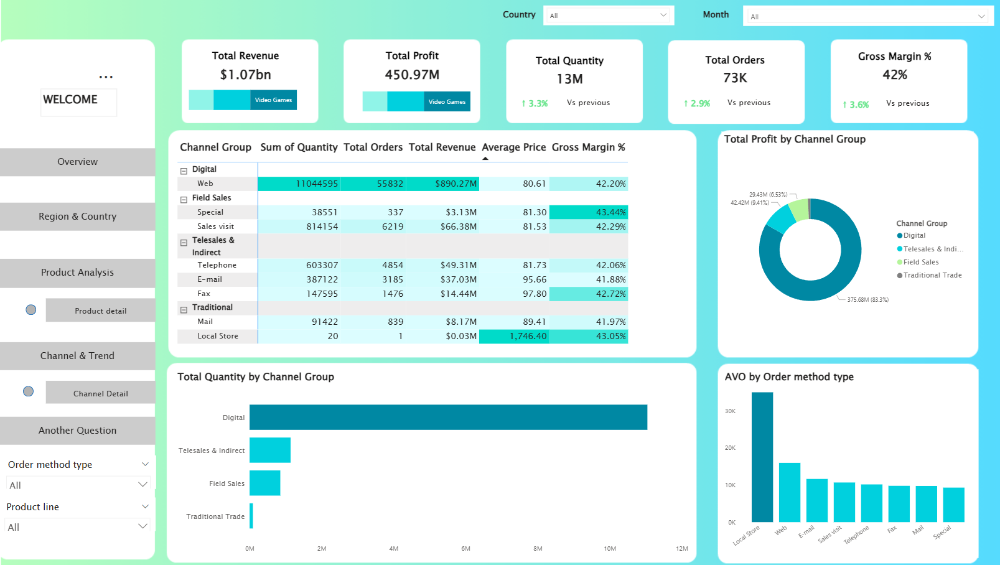
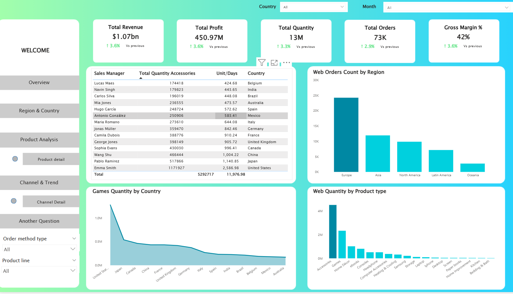

# 📊 Sales-Performance-Analysis
Real-time key metrics: $1.07B revenue, $451M profit, 73K orders, 13M units, 42.2% margin. Features revenue by country, product line donut chart, 2016-2018 profit/revenue trend, top sales managers leaderboard. Fully filterable &amp; responsive.
# Sales Performance Analysis Dashboard – Power BI

*(Replace the link above with your actual dashboard screenshot)*

## 📋Background
A global consumer electronics & lifestyle retailer operates in **14 countries** across North America, Europe, Asia, Latin America, and Oceania from **2016 to 2018**.  
The company offers five main product lines:  
- Video Games  
- Mobile  
- Computer  
- Home & Kitchen  
- Books  

With over **72,000 transactions** generated through multiple sales channels (Web, Telephone, E-mail, Sales visit, Fax, etc.), leadership required a single, interactive source of truth to monitor performance in real time.

## 💾 Objective
Deliver an executive-level Power BI dashboard that enables stakeholders to:  
- Monitor key metrics: **$1.07B+ revenue**, **$451M+ profit**, 73K orders, 13M units sold, 42.2% gross margin  
- Analyze performance by Country, Region, Product Line, Order Method, and Sales Manager  
- View multi-year trends (2016–2018) and YoY growth  
- Identify top-performing sales managers via dynamic leaderboard  
- Explore data instantly using interactive slicers and filters  

## 🔍 Dataset Overview
The project includes four clean Excel files:

| File                     | Description                                           | Rows     |
|--------------------------|-------------------------------------------------------|----------|
| `4.SalesManagement.xlsx` | Fact table – all transactions (Country, Order method, Product line/type, Date, Quantity, Price, Revenue, Unit Cost) | 72,704   |
| `2.Region.xlsx`          | Dimension – Country → Region mapping                  | 15       |
| `1.SalesManagers.xlsx`   | Dimension – Country → Sales Manager mapping           | 15       |
| `3.Dates.xlsx`           | Full Date table (Excel serial dates: 42370 → 43830)   | ~1,500+  |

#Overview Dashboard

**Interactive Executive Dashboard** delivering a 360° view of global sales performance (2016–2018)

### Key Metrics (All Time – All Countries)
| Metric            | Value               | Change vs Previous |
|-------------------|---------------------|--------------------|
| Total Revenue     | **$1.07 billion**   | ↑ 3.6%             |
| Total Profit      | **$450.97 million** | ↑ 3.6%             |
| Total Orders      | **73K**             | ↑ 3.3%             |
| Units Sold        | **13 million**      | ↑ 2.9%             |
| Gross Margin      | **42.20%**          | ↑ 3.6%             |

### Core Visualizations
- **Revenue by Country** (Bar Chart)  
  United States dominates (> $200M), followed by Japan, Canada, China, United Kingdom  

- **Revenue by Product Line** (Donut Chart)  
  1. Video Games – 38.75% ($414.3M)  
  2. Mobile      – 30.52% ($326.2M)  
  3. Computer    – 20.54% ($219.5M)  
  4. Home & Kitchen – 9.38% ($99.35M)  
  5. Books       – minor share  

- **Profit & Revenue Trend 2016–2018** (Area + Line Chart)  
  Consistent upward growth year-over-year  

- **Top Sales Managers Leaderboard**  
  | Rank | Sales Manager      | Country        | Total Revenue |
  |------|--------------------|----------------|---------------|
  | 1    | Wang Shu           | China          | $80.09M       |
  | 2    | George Jones       | United Kingdom | $79.86M       |
  | 3    | Jonas Müller       | Germany        | $78.84M       |
  | …    | …                  | …              | …             |

## 📈 Region & Country Analysis

### Europe – Dominant Region
- Accounts for **37.82%** of total revenue (~$400M), far ahead of North America (28.53%)  
- All other regions have significantly lower shares  
- North America has only **2 truly strong markets** (USA + Canada) → higher concentration risk compared to Europe  
- Europe has the **lowest unit cost** but also the **lowest average order value**  

### Asia – 3rd Place but Highest Growth Potential
- Ranks 3rd in revenue but delivers the **highest profit margin** → strong expansion opportunity  

### United States – The Giant
- Single-handedly contributes **~75-80 USD** per transaction on average, belongs to the **premium segment**  
- Despite high total revenue (~75-80 USD), growth in order volume is **relatively slow**  

### Developed European Countries (Germany, France, UK, Italy…)
- Extremely stable price bands, mostly **90–100 USD** per order  
- Customers focus on **high-end products**  

### China & India
- Rapidly growing order volume (China +3.3%, India +2.9%)  
- Still low average order value → huge potential when purchasing power rises  

### Australia (Oceania)
- Only +4.7% order growth → the slowest-growing region in the dataset  
- Needs further investment and marketing push  

### Overall Picture
- Revenue growth is strong, profit margin is healthy  
- **Asia** is the rising star, while Europe remains the stable cash cow  
- United States is the absolute revenue engine but shows slower volume growth than emerging Asia  

**Key Takeaway**: Balance between protecting mature markets (Europe + US) and aggressively expanding in high-margin, high-growth Asia.

## More Detail 

## Region & Country

### Europe – Dominant Region
- Accounts for **37.82%** of total revenue (~$400M), far ahead of North America (28.53%)  
- All other regions have significantly lower shares  
- North America has only **2 truly strong markets** (USA + Canada) → higher concentration risk compared to Europe  
- Europe has the **lowest unit cost** but also the **lowest average order value**  

### Asia – 3rd Place but Highest Growth Potential
- Ranks 3rd in revenue but delivers the **highest profit margin** → strong expansion opportunity  

### United States – The Giant
- Single-handedly contributes **~75-80 USD** per transaction on average, belongs to the **premium segment**  
- Despite high total revenue (~75-80 USD), growth in order volume is **relatively slow**  

### Developed European Countries (Germany, France, UK, Italy…)
- Extremely stable price bands, mostly **90–100 USD** per order  
- Customers focus on **high-end products**  

### China & India
- Rapidly growing order volume (China +3.3%, India +2.9%)  
- Still low average order value → huge potential when purchasing power rises  

### Australia (Oceania)
- Only +4.7% order growth → the slowest-growing region in the dataset  
- Needs further investment and marketing push  

### Overall Picture
- Revenue growth is strong, profit margin is healthy  
- **Asia** is the rising star, while Europe remains the stable cash cow  
- United States is the absolute revenue engine but shows slower volume growth than emerging Asia  

**Key Takeaway**: Balance between protecting mature markets (Europe + US) and aggressively expanding in high-margin, high-growth Asia.
## Channel Trend

### Digital (Web) – Absolute Dominant Channel
- Contributes **83.3%** of total profit and **~83%** of revenue  
- **90%** of orders placed online → “ăn hết” thị trường  
- Highest average order value (AOV) among digital channels  

### Field Sales (Sales visit) – High Margin Champion
- Only **6-7%** revenue share but delivers the **highest gross margin (43.44%)**  
- Extremely high AOV (up to **1,746 USD/order** when including Local Store visits) → focuses on premium/B2B deals and high-ticket items  

### Telesales & Indirect (Telephone, E-mail, Fax)
- Combined contribution **~41-42%** profit margin, but very low volume and AOV  
- Easy to maintain & scale → good supporting channels  

### Traditional Trade (Mail + Local Store)
- Very small revenue share (<1%), very low quantity per order  
- Web averages **~200 units/order**, while Local Store only ~20 → completely different scale and strategy  

### Fax & Special visit
- Very low volume but exceptionally high AOV → used for large B2B/B2G deals or custom orders  

### Key Takeaways
- **Digital/Web** has won the scale game and will continue to dominate  
- **Field Sales** and **Telesales** remain the **highest-margin channels** per order → must be preserved and optimized  
- Traditional & low-volume channels (Mail, Local Store) are no longer competitive in volume or e
## More Detail Trend

## Another Question – Seasonality & Key Observations

### Very Clear Seasonality Pattern
- Revenue peaks sharply at **year-end** (Nov–Dec), especially **Black Friday** period → the absolute strongest shopping season  
- **70.74%** of annual revenue is earned from **Monday to Thursday**, only **29.26%** on weekends → customers mostly shop on weekdays, no strong weekend preference  

### YTD (Year-to-Date) Performance
- No significant drop in any quarter → highly stable core business  
- **Q4/2018** is the strongest quarter in all 3 years (highest revenue & order volume) → consistent year-end surge  

### 2018 – Record-Breaking Year
- Daily revenue reached a peak of **3 million USD** on **November 23–25, 2018** (Black Friday + Cyber Monday)  
- 2018 officially became the **most successful year** in the entire dataset  

### Final Takeaways
- **Black Friday** and the final weeks of the year are make-or-break moments → all marketing, inventory, and logistics must concentrate here  
- Business is extremely stable throughout the rest of the year → low risk, highly predictable cash flow  
- Weekday shopping dominates → B2B and corporate purchases may play a larger role than initially thought  

**Recommendation**:  
Maximize investment and preparation for Q4 (especially Black Friday week) while maintaining lean, efficient operations for the remaining 10–11 months.
