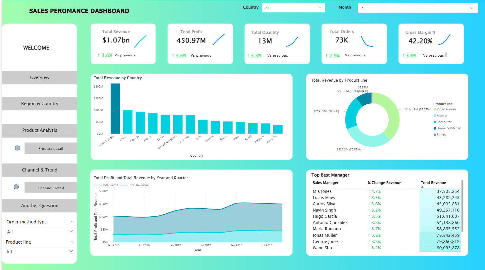

# Sales-Performance-Analysis
Real-time key metrics: $1.07B revenue, $451M profit, 73K orders, 13M units, 42.2% margin. Features revenue by country, product line donut chart, 2016-2018 profit/revenue trend, top sales managers leaderboard. Fully filterable &amp; responsive.
# Sales Performance Analysis Dashboard – Power BI

  
*(Replace the link above with your actual dashboard screenshot)*

## Background
A global consumer electronics & lifestyle retailer operates in **14 countries** across North America, Europe, Asia, Latin America, and Oceania from **2016 to 2018**.  
The company offers five main product lines:  
- Video Games  
- Mobile  
- Computer  
- Home & Kitchen  
- Books  

With over **72,000 transactions** generated through multiple sales channels (Web, Telephone, E-mail, Sales visit, Fax, etc.), leadership required a single, interactive source of truth to monitor performance in real time.

## Objective
Deliver an executive-level Power BI dashboard that enables stakeholders to:  
- Monitor key metrics: **$1.07B+ revenue**, **$451M+ profit**, 73K orders, 13M units sold, 42.2% gross margin  
- Analyze performance by Country, Region, Product Line, Order Method, and Sales Manager  
- View multi-year trends (2016–2018) and YoY growth  
- Identify top-performing sales managers via dynamic leaderboard  
- Explore data instantly using interactive slicers and filters  

## Dataset Overview
The project includes four clean Excel files:

| File                     | Description                                           | Rows     |
|--------------------------|-------------------------------------------------------|----------|
| `4.SalesManagement.xlsx` | Fact table – all transactions (Country, Order method, Product line/type, Date, Quantity, Price, Revenue, Unit Cost) | 72,704   |
| `2.Region.xlsx`          | Dimension – Country → Region mapping                  | 15       |
| `1.SalesManagers.xlsx`   | Dimension – Country → Sales Manager mapping           | 15       |
| `3.Dates.xlsx`           | Full Date table (Excel serial dates: 42370 → 43830)   | ~1,500+  |

#Overview Dashboard

Markdown# Sales Performance Dashboard – Overview

**Interactive Executive Dashboard** delivering a 360° view of global sales performance (2016–2018)

### Key Metrics (All Time – All Countries)
| Metric            | Value               | Change vs Previous |
|-------------------|---------------------|--------------------|
| Total Revenue     | **$1.07 billion**   | ↑ 3.6%             |
| Total Profit      | **$450.97 million** | ↑ 3.6%             |
| Total Orders      | **73K**             | ↑ 3.3%             |
| Units Sold        | **13 million**      | ↑ 2.9%             |
| Gross Margin      | **42.20%**          | ↑ 3.6%             |

### Core Visualizations
- **Revenue by Country** (Bar Chart)  
  United States dominates (> $200M), followed by Japan, Canada, China, United Kingdom  

- **Revenue by Product Line** (Donut Chart)  
  1. Video Games – 38.75% ($414.3M)  
  2. Mobile      – 30.52% ($326.2M)  
  3. Computer    – 20.54% ($219.5M)  
  4. Home & Kitchen – 9.38% ($99.35M)  
  5. Books       – minor share  

- **Profit & Revenue Trend 2016–2018** (Area + Line Chart)  
  Consistent upward growth year-over-year  

- **Top Sales Managers Leaderboard**  
  | Rank | Sales Manager      | Country        | Total Revenue |
  |------|--------------------|----------------|---------------|
  | 1    | Wang Shu           | China          | $80.09M       |
  | 2    | George Jones       | United Kingdom | $79.86M       |
  | 3    | Jonas Müller       | Germany        | $78.84M       |
  | …    | …                  | …              | …             |

